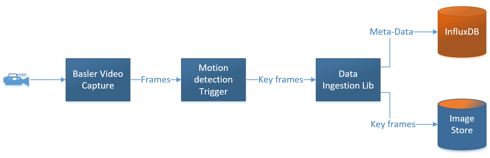
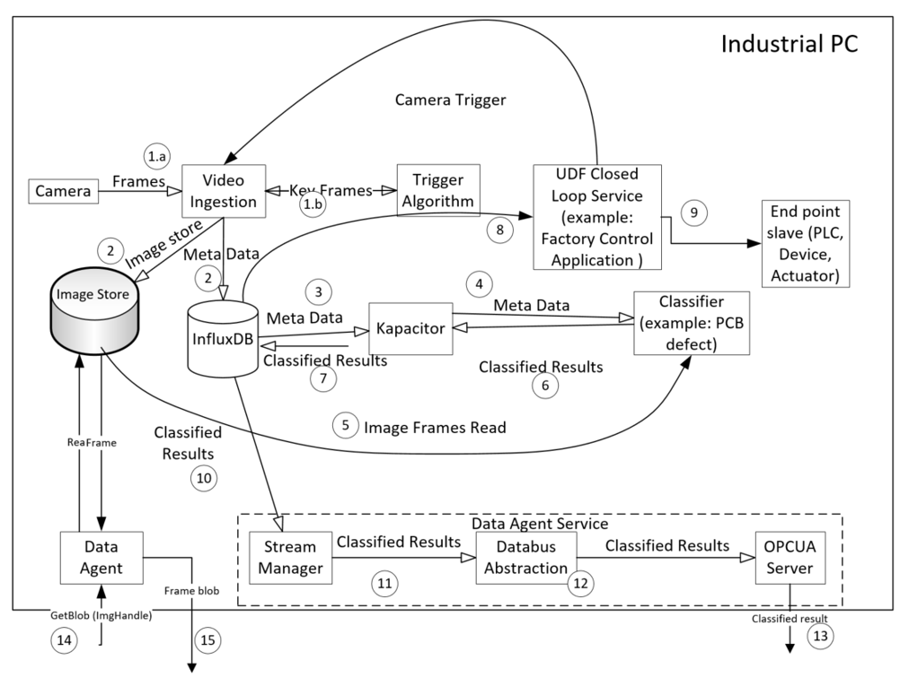
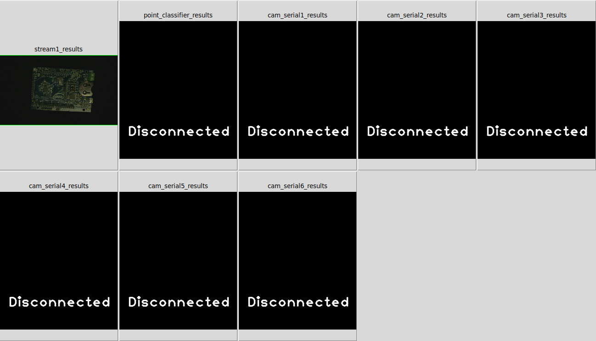

# Explore Intel® Edge Insights Software
## What is Intel® Edge Insights Software
Industrial Edge Insights Software (EIS) from Intel is a reference implementation of an analytics pipeline. The pipeline is designed as a set of micro-services that the customer can deploy in different configurations.

Edge Insights Software (EIS) implements the data ingestion, storage, alerting and monitoring and all the infrustructure software to support analytics applications. This leaves you, as the developer or systems integrator to focus on creating the application and not the infrastructure.  

In this lab, we will walk through the key files that the application developer will need to configure the build process and the microservices runtime.

## Configuration Overview

### The EtcD Key-Value Service Holds a Deployments Configuration

To learn more about etcd visit its homepage on Github at https://github.com/etcd-io/etcd

## Build Configurations

**$EIS_HOME/docker_setup/.env** contains all of the environmental variables for the micro-service build process. This includes Shell variables and Docker environmental variables.

Here are some of the important lines in the build configuration file
```sh
 13 # Docker security
 14 EIS_USER_NAME=eisuser
 15 EIS_UID=5319

 17 # This is the path where EIS package is installed
 18 EIS_INSTALL_PATH=/opt/intel/eis

 25 # DEV_MODE if set `true` allows one to run EIS in non-secure mode and provides additional UX/DX etc.,
 26 DEV_MODE=false
 27 # PROFILING_MODE is set 'true' allows to generate profile/performance data
 28 PROFILING_MODE=false

 45 # Etcd settings
 46 ETCD_NAME=master
 47 ETCD_VERSION=v3.4.0
 48 ETCD_DATA_DIR=/EIS/etcd/data/
 49 ETCD_RESET=true
 50 ETCD_CLIENT_PORT=2379
 51 ETCD_PEER_PORT=2380
 52 # For proxy environment, please append IP addresses or Range IP addresses of each node of the cluster to no_proxy
 53 # e.q. no_proxy=localhost,127.0.0.1,10.223.109.130,10.223.109.170
 54 no_proxy=localhost,127.0.0.1
 55 
 56 # TLS ciphers for ETCD, INFLUXDB
 57 TLS_CIPHERS=TLS_ECDHE_ECDSA_WITH_AES_128_GCM_SHA256,TLS_ECDHE_RSA_WITH_AES_128_GCM_SHA256,TLS_ECDHE_RSA_WITH_AES_256_GCM_SHA384
 58 SSL_KEY_LENGTH=3072
```

## Runtime Configurations

When the microservices start EtcD will come online. EtcD stores all of runtime configurations of the EIS system in a distributed and fault tolerant manner.

### The etcd_pre_load.json File
The **$EIS_HOME/docker_setup/provision/config/etcd_pre_load.json** file contains all of the default values that the system uses to initialize itself.

Each stage of the Video Analytics Pipeline has a configuration section.


### Video Ingestion

Video Ingestion is a service that defines the video sources. The sources can either be from a file stream or from a camera and more than 1 video ingestor can be defined.

Here is an example of configuring a video file source.
```json
  2     "/VideoIngestion/config": {
  3         "ingestor": {
  4             "video_src": "./test_videos/pcb_d2000.avi",
  5             "encoding": {
  6                 "type": "jpg",
  7                 "level": 100
  8             },
  9             "loop_video": "true",
 10             "poll_interval": 0.2
 11         },
 12         "filter": {
 13             "name": "pcb_filter",
 14             "queue_size": 10,
 15             "max_workers": 1,
 16             "training_mode": "false",
 17             "n_total_px": 300000,
 18             "n_left_px": 1000,
 19             "n_right_px": 1000
 20         }
 21 
 22     },
```

Here is an example of two cameras. The first camera uses RTSP and the second camera uses serial communications
```json
2     "/VideoIngestion1/config": {
  3         "ingestor": {
  4         "video_src": "rtspsrc location=\"rtsp://localhost:8554/\" latency=100 ! rtph264depay ! h264parse ! vaapih264dec ! vaapipostproc format=bgrx ! videoconvert ! appsink max_buffers=2 drop=TRUE",
  5         "encoding": {
  6             "type": "jpg",
  7             "level": 100
  8         },
  9         "poll_interval": 0.2
 10     },
 11     "filter": {
 12         "name": "bypass_filter",
 13         "queue_size": 10,
 14         "max_workers": 1,
 15         "training_mode": "false"
 16     }
 17 
 18     },
 19     "/VideoIngestion2/config": {
 20         "ingestor": {
 21             "video_src": "pylonsrc serial=22573662 imageformat=yuv422 exposureGigE=3250 interpacketdelay=1500 ! videoconvert ! appsink",
 22             "encoding": {
 23                 "type": "jpg",
 24                 "level": 100
 25             },
 26             "poll_interval": 0.2
 27         },
 28         "filter": {
 29             "name": "bypass_filter",
 30             "queue_size": 10,
 31             "max_workers": 1,
 32             "training_mode": "false",
 33             "n_total_px": 300000,
 34             "n_left_px": 1000,
 35             "n_right_px": 1000
 36         }
 37 
 38     },
```


This JSON file is the main configuration file for the entire data pipeline. Using this file, a user can define the data ingestion, storage, triggers, and classifiers to be used in the application.

This file is located in **$EIS_HOME/Workshop/IEdgeInsights-v1.5LTS/docker_setup/config/algo_config/factory_pcbdemo.json**

Take a look at the file now and notice some key elements: 

### Video Ingestion

```json
"data_ingestion_manager": {
        "ingestors": {
            "video_file": {
                "video_file": "./test_videos/pcb_d2000.avi",
                "encoding": {
                    "type": "jpg",
                    "level": 100
                },
                "img_store_type": "inmemory_persistent",
                "loop_video": true,
                "poll_interval": 0.2
            }
        }
    }
```

Here we see the video file set as "./test_videos/pcb_d2000.avi" this path is relative to **$EIS_HOME/docker_setup/**

### Trigger Setup

```json
    "triggers": {
        "pcb_trigger": {
            "training_mode": false,
            "n_total_px": 300000,
            "n_left_px": 1000,
            "n_right_px": 1000
        }
```

Here we see the trigger set as **pcb_trigger** - this specifices that we will use **$EIS_HOME/algos/dpm/triggers/pcb_trigger.py** as the trigger script for our application. The script that calls the trigger is **$EIS_HOME/VideoIngestion/VideoIngestion.py**


Classifier Setup:
```json
 "classification": {
        "max_workers": 1,
        "classifiers": {
            "pcbdemo": {
                "trigger": [
                    "pcb_trigger"
                ],
                "config": {
                    "ref_img": "./algos/algo_config/ref_pcbdemo/ref.png",
                    "ref_config_roi": "./algos/algo_config/ref_pcbdemo/roi_2.json",
                    "model_xml": "./algos/algo_config/ref_pcbdemo/model_2.xml",
                    "model_bin": "./algos/algo_config/ref_pcbdemo/model_2.bin",
                    "device": "CPU"
                }
            }
        }
    }
```

This block defines the classification module where we specify the classifer name **pcbdemo** - This will be used by **$EIS_HOME/algos/dpm/classification/classifier_manager.py** to set the connection between the Trigger module and Classification module by using the **$EIS_HOME//algos/dpm/classification/classifiers/pcbdemo** folder as the location of the classification scripts.

:warning: This folder must be in this location and have the same name as the classifier to function. 

The **config** section defines all of the arguments that are passed to the classifier. This particular classifier will use OpenVINO :wine_glass:. OpenVINO requires a **neural network model file** in itermediate representation format and the **device hardware** that the inference will be run on.


This block also sets the **ref_img** reference image and **ref_config_roi** region of interest configuration files. These files are used in the Mobilenet defect detection algorithm. 

### Video Ingestion
The Video Ingestion module uses the Data Ingestion library to setup multiple video feeds and pass the frames to the data preprocessing micro-service. 




The Video Ingestion micro-service can setup multiple video streams. These streams may be gstreamer RTSP streams, video cameras, or video files.

For example the **$EIS_HOME/docker_setup/config/algo_config/factory_multi_cam.json** configuration file outlines how to load multiple RTSP camera streams:

```
 "data_ingestion_manager": {
        "ingestors": {
            "video": {
                "vi_queue_size":5,
                "streams": {
                    "capture_streams": {
                        "cam_serial1": {
                            "video_src": "rtspsrc location=\"rtsp://localhost:8554/\" latency=100 ! rtph264depay ! h264parse ! mfxdecode ! videoconvert ! appsink",
                            "encoding": {
                                "type": "jpg",
                                "level": 100
                            },
                            "img_store_type": "inmemory_persistent",
                            "poll_interval": 0.2
                        },
                        "cam_serial2": {
                            "video_src": "rtspsrc location=\"rtsp://localhost:8554/\" latency=100 ! rtph264depay ! h264parse ! mfxdecode ! videoconvert ! appsink",
                            "encoding": {
                                "type": "jpg",
                                "level": 100
                            },
                            "img_store_type": "inmemory_persistent",
                            "poll_interval": 0.2
                        },
```

*Location:*$EIS_HOME/VideoIngestion/

### Trigger
This filters the incoming data stream, mainly to reduce the storage and computation requirements by only passing frames of interest. All input frames are passed to the Trigger.  When it detects a frame of interest based on user defined functions, it activates a signal which causes that frame to be saved in the Image Store database, and the metadata for that frame in the InfluxDB database.

*Location:*~/Workshop/IEdgeInsights-v1.5LTS/algos/dpm/triggers/

##### Classifier
The is a user defined algorithm that is run on each frame of interest. Kapacitor, an open source data processing engine, subscribes to the meta-data stream , and the classifier receives the meta-data from Kapacitor. The classifier pulls the frame from the Image Store, and saves the analysis results as metadata back into the InfluxDB database.

*Location:*~/Workshop/IEdgeInsights-v1.5LTS/algos/dpm/classification/classifiers/

##### Visualizer
      The visualizer is not a video viewer! It is pulling frames that have a classification result from the object store and displaying them rapidly one after another.

*Location:*~/Workshop/IEdgeInsights-v1.5LTS/tools/visualizer/


### Data Flow in Edge Insights Software

We have reviewed the architectural components of EIS. Now let's understand how data flows between these components.



**Step-1.a:**
The Video Ingestion module starts capturing frames from Basler camera /
RTSP camera (or video file) and sends the frames to the Trigger Algorithm.

**Step-1.b:**
The Trigger Algorithm will determine the relevant frames that are to go to
the Classifier. In the PCB demo use case, the Trigger Algorithm selects the images with the full PCB within view and send relavant frames to teh Video Ingestion.

**Step-2:**
The relevant frames from the Trigger Algorithm are stored into Image Store and the corresponding meta-data is stored in InfluxDB

**Step-3:**
Kapacitor subscribes to the Meta Data stream. All the streams in InfluxDB are subscribed as default by Kapacitor.

**Step-4:**
The Classifier UDF (User Defined Function) receives the Meta Data from Kapacitor. It then invokes the UDF classifier algorithm.

**Step-5:**
UDF Classifier Algorithm fetches the image frame from the Image Store and
generates the Classified Results with defect information, if any. Each frame
produces one set of Classified Results.

**Step-6:**
The Classifier UDF returns the classified results to Kapacitor.

**Step-7:**
The Kapacitor saves the Classified Results to InfluxDB. This behavior is enforced in the Kapacitor TICK script.

**Step-8:**
The Classified Results are received by Factory Control Application.

**Step-9:**
The Factory Control Application will turn on the alarm light if a defect is found in the part.

**Step-10:**
The Stream Manager subscribes to the Classified Results stream. The policy of stream export is set in the Stream Manager.

**Step-11:**
The Stream Manager uses the Data Bus Abstraction module interfaces to publish the Classified Results stream. The Data Bus Abstraction provides a publish-subscribe interface.

**Step-12:**
Data Bus Abstraction creates an OPC-UA Server, which exposes the Classified Results data as a string.

**Step-13:**
The Classified result is published in the OPC-UA message bus and available to external applications

**Step-14:**
The image handle of the actual frame is part of the Classified Results. The raw image can be retrieved through the data agent using the GetBlob() API.

**Step-15:**
The raw image frame is returned in response to the GetBlob() command.


**NOTE:** As an application developer, you do not need to worry about handling the data flow described above from data ingestion to classification. The included software stack using InfluxDB and Kapacitor handle the data movement and storage.


### Running Defect detection demo application                            
**Description**   
Printed Circuits Boards(PCBs) are being inspected for quality control to check if any defects(missing component or components are short) are there with the PCBs. To find out the defects a good quality PCB will be compared against the defective ones and pin point the location of the defect as well.

Input to the application can be from a live stream or from a video file. Here video file (~/Workshop/IEdgeInsights-v1.5LTS/docker_setup/test_videos/pcb_d2000.avi) is used for this demo.

**Build and Run Sample.**  
To **build and run** the sample pcbdemo sample application execute the following commands.

```bash
cd ~/Workshop/IEdgeInsights-v1.5LTS/docker_setup/
sudo make build run
```

Once this completes run the following command to view the log:

```bash
tail -f /opt/intel/iei/logs/consolidatedLogs/iei.log
```
If everything is running properly you will see:

```
ia_data_agent         | I0829 11:46:55.835922       6 StreamManager.go:191] Publishing topic: stream1_results
```
Which is indicating that the ia_data_agent container is streaming data on the "stream1_results" topic. 

To **Visualize** the sample application , execute the below command:

```bash
cd ~/Workshop/IEdgeInsights-v1.5LTS/tools/visualizer
source ./source.sh
python3 visualize.py -D true
```
This will run the vizualizer in developer mode (no certificates needed). 

**Pcb-Demo Output**   
Once the application successfully runs. The output window will be poped up as below.



You should now understand the Intel® Edge Insights Software framework components and how run pcbdemo application successfully.    
Let's Deploy a Restricted Zone Notifier Reference implementation using Intel® Edge Insights Software framework in our next lab.

## Next Lab
[Understanding of Converting Python based RI to classifier and trigger based IEI Software](./understanding_ri_to_eis_conversion.md)
