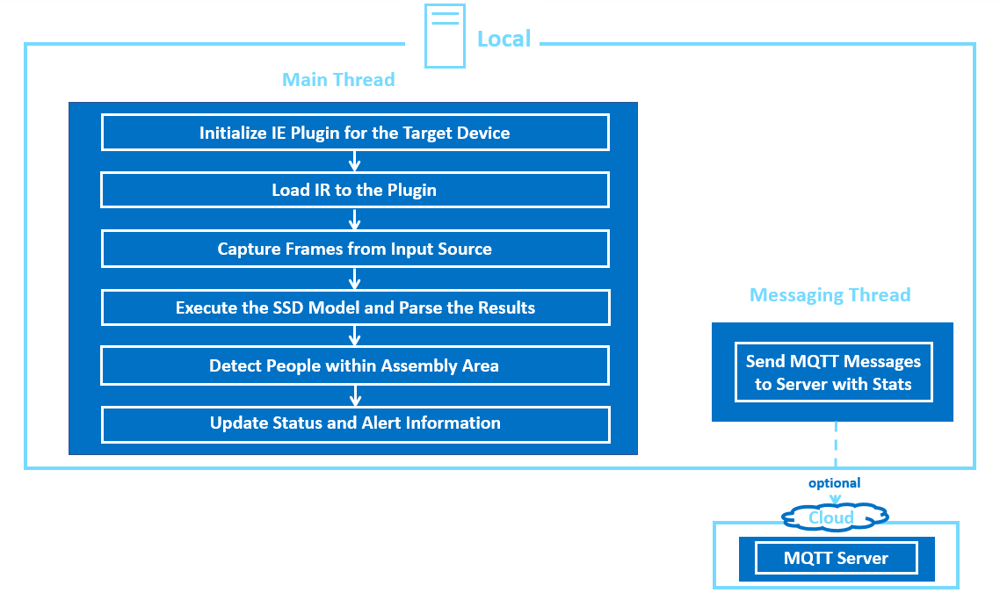
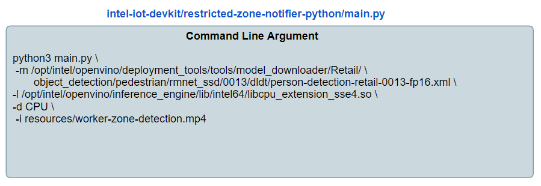

# Implementing an Classifier and Preprocessing Trigger based Intel® Edge Insights (EIS) Software

This lab shows the steps that an application developer will need to implement to create a video analytics solution on the Edge Insights Software framework.

## Reference Implementations on the Intel Development Zone

The Intel Developer Zones has many reference implementation applications, sample code snippets and whitepapers to help you start building with Intel technology.

On the [Industrial Reference Implementations and Code Samples](https://software.intel.com/en-us/industrial) page, you can browser difference ready-made applications. We will be porting the [Restricted Zone Notifier](https://software.intel.com/en-us/iot/reference-implementations/restricted-zone-notifier) to the Edge Insights Software framework.

The source code for the Restricted Zone Notifier can be found on Github.
https://github.com/intel-iot-devkit/restricted-zone-notifier-python.

## Description of the Restricted Zone Notifier that will be Ported to EIS

First let's look at the reference implementation of the Restricted Zone Notifier. This is an OpenVino application which determines whether a worker is in an unsafe or restricted zone. The classification results are sent to an MQTT broker and published for third-party applications.

## Steps to Port Application to EIS
First, let's review how the system is initialized and the steps that are needed in order to create a new application for EIS. 

1. 
Create the new classifier Python file and a directory to hold related files such as the OpenVINO models and label files
Modify the runtime configuration file that are loaded into etcd at provisioning time.
2. What is a directory called restricted Zone Notifier in the classifier directory
3. Create a Python file for the user defined classifier algorithm
4. Deploy application

###

First, let us have a look on the below code flow for the restricted zone notifier application.



**Now**, Lets understand how we can convert this python based RI to EIS framework step by step.

### Setup Environmental Variables

For our convenience, let's set an environmental variable called **EIS_HOME** to refer to the root level directory of the Edge Insights Software.

**During the workshop be sure to check this location on YOUR COMPUTER or ask your instructor which directory EIS is installed in. **

```bash
export EIS_HOME=/home/eis/IEdgeInsights-lab-restricted-zone-notifier
```

### Create Directories for the New EIS Application

First, let's create the directory for the new user-defined classification function and create an empty ****init**.py** file to contain our implementation.

```bash
mkdir $EIS_HOME/VideoAnalytics/classifiers/restrictedzonenotifier
touch $EIS_HOME/VideoAnalytics/classifiers/restrictedzonenotifier.py
```

### System wide configuration 

When launching the reference implementation normally parameters such as the model to use, any library plugins, the hardware to run inference on, and the location of the input file are set on the command line:



For EIS we will follow the steps below. 

All of the runtime configurations for the docker containers in the EIS system are stored within etcd, a key value store that serves as a central repository for configuration.

Etcd reads in a configuration file located at 
**$EIS_HOME/docker_setup/provision/config/etd_pre_load.json**
 
The containers that are configured here include:
* VideoInvestion
* VideoAnalytics
* Visualizer
* InfluxDBConnector
* Kapacitor
* FactoryControlApp
* ImageStore

This file will contain a JSON object that defines the video sources, preprocessing trigger location and the classifier function location.

We will set these configuration parameters in the restricted_zone_notifier.json application configuration file in the **video_file**, **model_xml**, **model_bin**, and **device** fields. 

We will also set the filter alogorithm and the classification alogrithm to be used in the solution in this configuration file. 

The reference implementation does not have any data pre-processing so we will use the **bypass_trigger** which sends all incoming frames to the classification engine. 

For the classification module we will point to the currently empty **restrictedzonenotifier** folder that we created earlier. 

Create the .json file:

### json not correct

```bash
gedit $EIS_HOME/docker_setup/provision/config/etd_pre_load.json
```

Next copy and paste this text into the newly created file:

```JSON
{
    "/VideoIngestion/config": {
        "ingestor": {
            "video_src": "./test_videos/workers_walking.mp4",
            "encoding": {
                "type": "jpg",
                "level": 100
            },
            "loop_video": "true",
            "poll_interval": 0.2
        },
        "filter": {
            "name": "bypass_trigger",
        }

    },
    "/VideoAnalytics/config": {
        "name": "pcb_classifier",
        "queue_size": 10,
        "max_workers": 1,
        "ref_img": "./VideoAnalytics/classifiers/ref_pcbdemo/ref.png",
        "ref_config_roi": "./VideoAnalytics/classifiers/ref_pcbdemo/roi_2.json",
        "model_xml": "./VideoAnalytics/classifiers/ref_pcbdemo/model_2.xml",
        "model_bin": "./VideoAnalytics/classifiers/ref_pcbdemo/model_2.bin",
        "device": "CPU"
    },
    "/Visualizer/config": {
        "display": "true",
        "save_image": "false",
        "cert_path": ""
    },
    "/InfluxDBConnector/config": {
        "influxdb": {
            "retention": "1h30m5s",
            "username": "admin",
            "password": "admin123",
            "dbname": "datain",
            "ssl": "True",
            "verifySsl": "False",
            "port": "8086"
        },
        "pub_workers" : "5",
        "sub_workers" : "5"
    },
    "/Kapacitor/config": {
        "influxdb": {
            "username": "admin",
            "password": "admin123"
        }
    },
    "/FactoryControlApp/config": {
        "io_module_ip": "localhost",
        "io_module_port": 502,
        "red_bit_register": 20,
        "green_bit_register": 19
    },
    "/ImageStore/config": {
        "minio":{
           "accessKey":"admin",
           "secretKey":"password",
           "retentionTime":"1h",
           "retentionPollInterval":"60s",
           "ssl":"false"
        }
    },
    "/GlobalEnv/": {
        "COMPOSE_HTTP_TIMEOUT":"200",
        "COMPOSE_PROJECT_NAME":"EIS_docker_network",
        "EIS_USER_NAME":"eisuser",
        "EIS_UID":"5319",
        "EIS_INSTALL_PATH":"/opt/intel/eis",
        "PY_LOG_LEVEL":"INFO",
        "GO_LOG_LEVEL":"INFO",
        "GO_VERBOSE":"0",
        "HOST_TIME_ZONE":"",
        "ETCD_KEEPER_PORT":"7070"
    }
}

```

### Creating the Classifier algorithm 

In EIS the classifier algorithm has 3 meathods: 


`__init__` : The method used for initialization and loading the intermediate representation model into the plugin. 
 
`classify` : The method used for inferencing and capturing the inference output.
 
`ssd_out`: The method used fpr parsing the classification output. 

We will use the main python script from the [reference implementation](https://github.com/intel-iot-devkit/restricted-zone-notifier-python/blob/master/application/restricted_zone_notifier.py) as a basis in creating these three methods and add them to our **restrictedzone.py** file.

### Import modules and create Classifier class

First we will import all python modules that will be used in the classifier algorithm and create the main **Classifier** class which will contain our methods:

First open our **restrictedzone.py** file:

```bash
gedit $EIS_HOME/algos/dpm/classification/classifiers/restrictedzone.py
```

and copy the following code at the top:

```python
import os
import logging
import cv2
import numpy as np
import json
import threading

from .defect import Defect
from libs.base_classifier import BaseClassifier
from openvino.inference_engine import IENetwork, IEPlugin
from distutils.util import strtobool
import time

import sys

from collections import namedtuple

MyStruct = namedtuple("assemblyinfo", "safe")
INFO = MyStruct(True)
PERSON_DETECTED = 1


def trace_calls(frame, event, arg):
    if event != 'call':
        return
    co = frame.f_code
    func_name = co.co_name
    if func_name == 'write':
        # Ignore write() calls from print statements
        return
    func_line_no = frame.f_lineno
    func_filename = co.co_filename
    caller = frame.f_back
    caller_line_no = caller.f_lineno
    caller_filename = caller.f_code.co_filename
    logging.info('Call to %s on line %s of %s from line %s of %s' % \
                 (func_name, func_line_no, func_filename,
                  caller_line_no, caller_filename))
    return
```
### Create Classifier class

```python
class Classifier(BaseClassifier):
```

To create the `__init__` method we will check that the model files exist, load the plugin for CPU, load the CPU extension libraries, and check that the layers of the model are supported.

Paste is the following code into the Classifier class. Make sure to indent the code.

```python
    def __init__(self, classifier_config, input_queue, output_queue):
        """Constructor of Classifier class

        :param classifier_config: Configuration object for the classifier
        :type classifier_config: dict
        :param input_queue: input queue for classifier
        :type input_queue: queue
        :param output_queue: output queue of classifier
        :type output_queue: queue
        :return: Classification object
        :rtype: Object
        """
        logging.info('Launching restrictedzonenotififier.py __init__ method')
        super().__init__(classifier_config, input_queue, output_queue)
        # self.log = logging.getLogger('PCB_DEFECT_DETECTION')
        self.model_xml = classifier_config["model_xml"]
        self.model_bin = classifier_config["model_bin"]
        self.device = classifier_config["device"]

        # Assert all input parameters exist
        assert os.path.exists(self.model_xml), \
            'Tensorflow model missing: {}'.format(self.model_xml)
        assert os.path.exists(self.model_bin), \
            'Tensorflow model bin file missing: {}'.format(self.model_bin)

        # Load OpenVINO model
        self.plugin = IEPlugin(device=self.device.upper(), plugin_dirs="")
        self.net = IENetwork.from_ir(model=self.model_xml,
                                     weights=self.model_bin)
        self.input_blob = next(iter(self.net.inputs))
        self.output_blob = next(iter(self.net.outputs))
        self.net.batch_size = 1  # change to enable batch loading
        self.exec_net = self.plugin.load(network=self.net)
        self.profiling = bool(strtobool(os.environ['PROFILING_MODE']))

   ```


### Create Classify method 

To create the `classify` method we will use the section of the main function loop that runs the single shot detector on each frame as as well as the section of code that writes the alerts out to the screen as a basis.

Paste is the following code into our Classifier class:

```python
    def classify(self):
        """Reads the image frame from input queue for classifier
        and classifies against the specified reference image.
        """
        logging.info('Launching restrictedzonenotififier.py classify method')
        logging.info('stop_ev_is_set=%s', self.stop_ev.is_set())
        frame_count = 0
        while not self.stop_ev.is_set():
            metadata, frame = self.input_queue.get()
            logging.info('metadata=%s', metadata)
            logging.info('frame type=%s', type(frame))
            p_detect = []
            frame_count = frame_count + 1


            # Convert the buffer into np array.

            np_buffer = np.frombuffer(frame, dtype=np.uint8)
            if 'encoding_type' and 'encoding_level' in metadata:
                reshape_frame = np.reshape(np_buffer, (np_buffer.shape))
                reshape_frame = cv2.imdecode(reshape_frame, 1)
            else:
                reshape_frame = np.reshape(np_buffer, (int(metadata["height"]),
                                                       int(metadata["width"]),
                                                       int(metadata["channel"])
                                                       ))

            initial_wh = [reshape_frame.shape[1], reshape_frame.shape[0]]
            n, c, h, w = self.net.inputs[self.input_blob].shape
            roi_x, roi_y, roi_w, roi_h = [0, 0, 0, 0]

            if roi_x <= 0 or roi_y <= 0:
                roi_x = 0
                roi_y = 0
            if roi_w <= 0:
                roi_w = reshape_frame.shape[1]
            if roi_h <= 0:
                roi_h = reshape_frame.shape[0]
            cv2.rectangle(reshape_frame, (roi_x, roi_y),
                          (roi_x + roi_w, roi_y + roi_h), (0, 0, 255), 2)
            selected_region = [roi_x, roi_y, roi_w, roi_h]
            in_frame_fd = cv2.resize(reshape_frame, (w, h))
            # Change data layout from HWC to CHW
            in_frame_fd = in_frame_fd.transpose((2, 0, 1))
            in_frame_fd = in_frame_fd.reshape((n, c, h, w))

            # Start asynchronous inference for specified request.
            logging.info("starting inference")
            inf_start = time.time()

            res = self.exec_net.infer(inputs={self.input_blob: in_frame_fd})

            det_time = time.time() - inf_start
            res = res[self.output_blob]
            # res = self.exec_net.requests[0].outputs[self.output_blob]

            # Parse SSD output
            logging.info("Process output #{}".format(frame_count))
            safe, person = self.ssd_out(res, initial_wh, selected_region)

            logging.info(safe)
            logging.info(person)
            if person:
                x, y, x1, y1 = [person[0][i] for i in (0, 1, 2, 3)]
                p_detect.append(Defect(PERSON_DETECTED, (x, y), (x1, y1)))


            '''
            if p_detect:
                warning = "HUMAN IN ASSEMBLY AREA: PAUSE THE MACHINE!"
                d_info.append(DisplayInfo('Worker Safe: False', 2))
                d_info.append(DisplayInfo(warning, 2))
            else:
                d_info.append(DisplayInfo('Worker Safe: True', 0))

            logging.info("d_info:")
            logging.info(d_info)
            '''
            defects=[]
            for d in p_detect:
                if d.defect_class == PERSON_DETECTED:
                    defects.append({
                        'type': d.defect_class,
                        'tl': d.tl,
                        'br': d.br
                    })
                else:
                    logging.info("None")

            metadata["display_info"] = defects

            if self.profiling is True:
                metadata['ts_va_classify_exit'] = time.time() * 1000

            logging.info('SENDING FRAME {} TO OUTPUT QUEUE'.format(frame_count))

            self.output_queue.put((metadata, frame))
            logging.info('Frame sent to queue')
            self.log.info("metadata: {} added to output queue".format(
                metadata))

 ```

### Create ssd_out method

The `ssd_out` method is used to parse the classifier output. We will use the `ssd_out` method in the reference python script as the basis.

Paste is the following code into our Classifier class:

```python
    def ssd_out(self, res, initial_wh, selected_region):
        """
        Parse SSD output.

        :param res: Detection results
        :param args: Parsed arguments
        :param initial_wh: Initial width and height of the frame
        :param selected_region: Selected region coordinates
        :return: safe,person
        """
        logging.info("called ssd_out with res, initial_wh, selected_region:")
        #logging.info(res)
        #logging.info(initial_wh)
        #logging.info(selected_region)
        global INFO
        person = []
        INFO = INFO._replace(safe=True)

        for obj in res[0][0]:
            # Draw objects only when probability is more than specified threshold
            if obj[2] > 0.5:
                xmin = int(obj[3] * initial_wh[0])
                ymin = int(obj[4] * initial_wh[1])
                xmax = int(obj[5] * initial_wh[0])
                ymax = int(obj[6] * initial_wh[1])
                person.append([xmin, ymin, xmax, ymax])

        for p in person:
            # area_of_person gives area of the detected person
            area_of_person = (p[2] - p[0]) * (p[3] - p[1])
            x_max = max(p[0], selected_region[0])
            x_min = min(p[2], selected_region[0] + selected_region[2])
            y_min = min(p[3], selected_region[1] + selected_region[3])
            y_max = max(p[1], selected_region[1])
            point_x = x_min - x_max
            point_y = y_min - y_max
            # area_of_intersection gives area of intersection of the
            # detected person and the selected area
            area_of_intersection = point_x * point_y
            if point_x < 0 or point_y < 0:
                continue
            else:
                if area_of_person > area_of_intersection:
                    # assembly line area flags
                    INFO = INFO._replace(safe=True)
                else:
                    # assembly line area flags
                    INFO = INFO._replace(safe=False)
        return INFO.safe, person
   ```


### Messaging Thread

The Python based reference implementation messaging thread publishes MQTT messages to Server to display the output.

In the EIS framework, the messages are published over OPC-UA by the Data Agent Service. We will use an OPC-UA client to view those messages. This OPC/UA client is located in **$EIS_HOME/tools/visualizer** and does not need to be customized for this application.

You should now have a better idea of how an existing code base can be converted to Classifier and Trigger based Intel® Edge Insights (EIS) Software. In the next, lab we will implement all of these modules and run the restricted zone notifier using EIS.

## Next Lab

[Deploying Restricted Zone Notifier using Edge Insights Software framework](./lab_restricted_zone_notifier.md)
